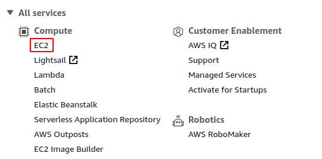
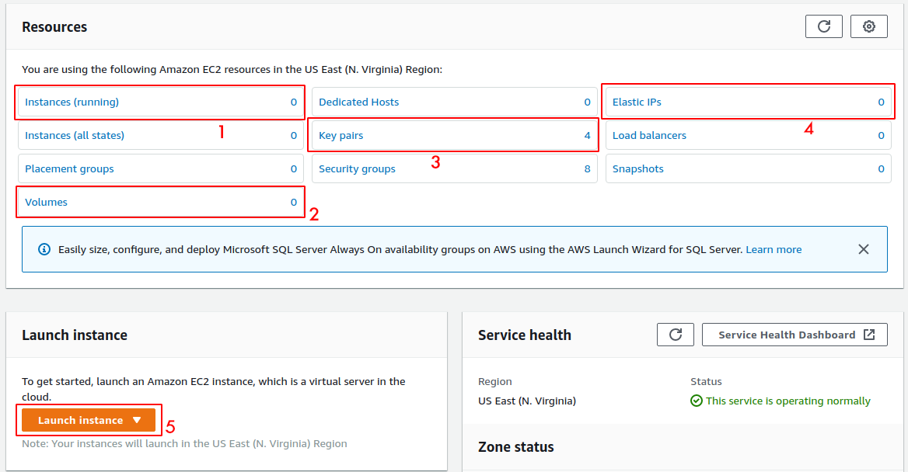
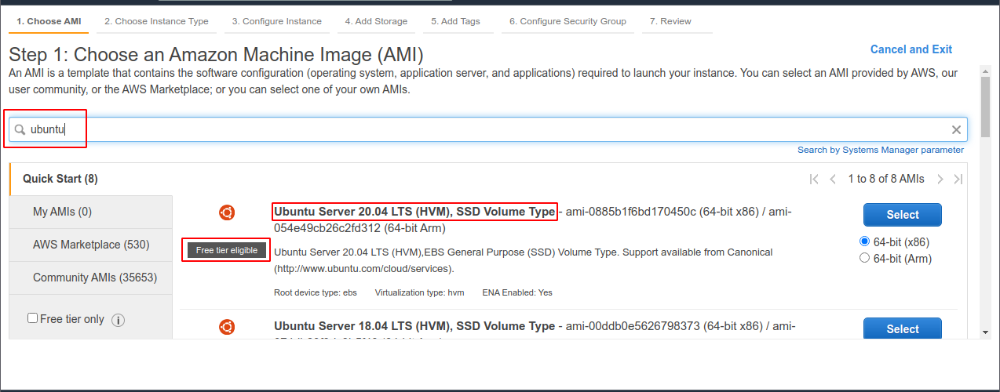
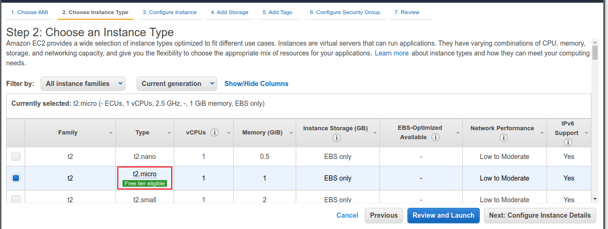
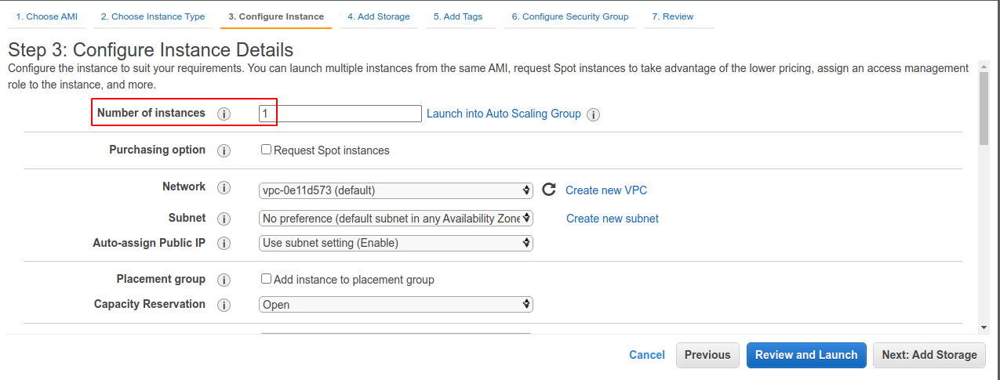
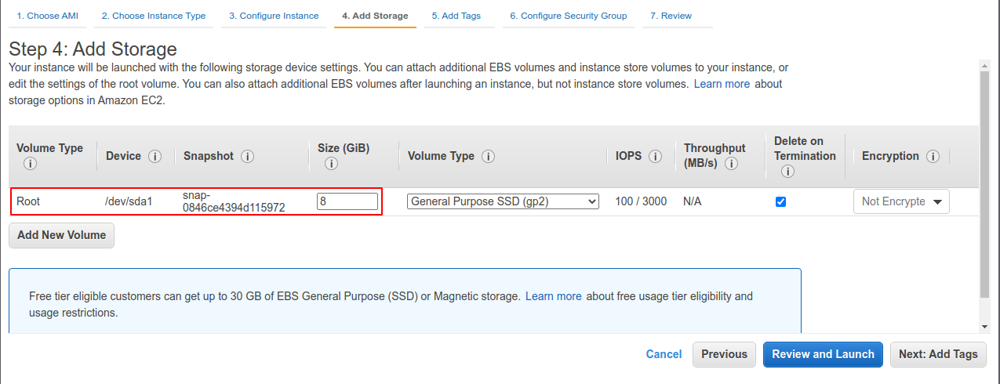
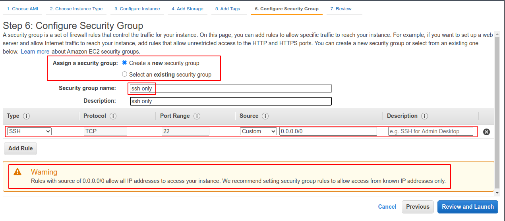
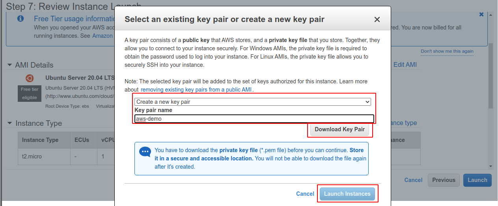
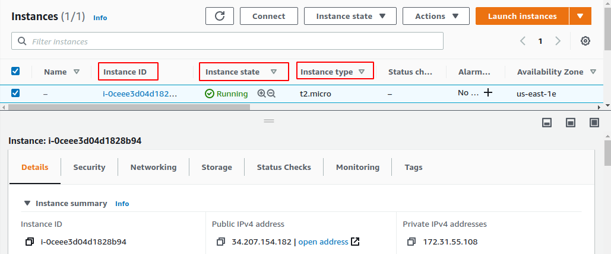
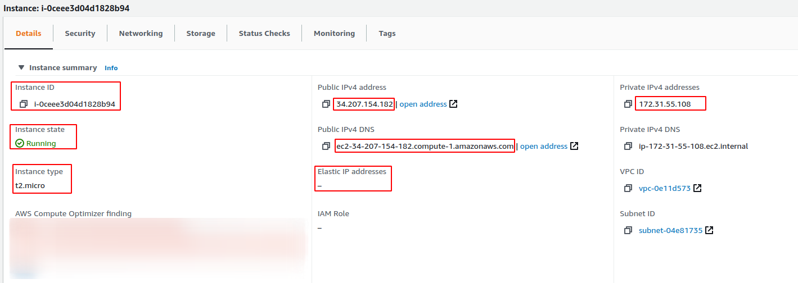

# Intro to Cloud Computing (AWS)
In this project, I was introduced to the AWS cloud environment. Starting from how to create an awseducate account to creating an ec2 instance.

## Table of contents
- [Intro to Cloud Computing (AWS)](#intro-to-cloud-computing-aws)
  - [Table of contents](#table-of-contents)
  - [1. AWS Account](#1-aws-account)
  - [2. Dashboard](#2-dashboard)
  - [3. EC2 Dashboard](#3-ec2-dashboard)
  - [4. Launching new Instance](#4-launching-new-instance)
    - [Step 1: Choose AMI](#step-1-choose-ami)
    - [Step 2: Choose Instance Type](#step-2-choose-instance-type)
    - [Step 3: Configure Instance](#step-3-configure-instance)
    - [Step 4: Add Storage](#step-4-add-storage)
    - [Step 5: Add Tags](#step-5-add-tags)
    - [Step 6: Configure Security Group](#step-6-configure-security-group)
    - [Step 7: Review](#step-7-review)
  - [5. EC2 Instance Detail](#5-ec2-instance-detail)

## 1. AWS Account

There's two option for you to create AWS account, if you are a student, sign up for aws educate account in [this link](https://www.awseducate.com/). If you are not a student, simply create aws [free tier account](https://aws.amazon.com/free/).

## 2. Dashboard

In the dashboard, there's so much service provided by AWS. For this intro project, we will focus on EC2. Click EC2 in the Compute section to launch EC2 dashboard.

## 3. EC2 Dashboard

In this EC2 dashboard, we will see many term and subsection. We will focus on 5 of them. The first one is Instance (running), in this subsection we will see how many aws instance that are currently running (booting up). The second one is Volumes, in this section we can see how many volume do we have (volume is like an ssd or disk drive, but in the cloud). The third is Key pairs, key pair is the key that we use to connect to our instance. Fourth is Elastic IP that we have. Then the fifth is option to launch new EC2 instance, click to launch instance.

## 4. Launching new Instance

There are 7 step for launching an instance on AWS. The first one is to choose image, either from AWS or community (or even add your own image).

### Step 1: Choose AMI

Search "ubuntu" in the search bar and choose "Ubuntu Server 20.04". Here, we can see that there's "Free tier eligible" notes on the bottom of the logo. It means that, this image can be used for AWS free account and don't have additional cost. Select the image.

### Step 2: Choose Instance Type

Choose t2.micro that have "free tier eligible" notes. Some notes on choosing instance type, we can scale and modify our instance type later on the instance setting (that's the cool part about cloud computing). So for example, now I launch a t2.micro instance for my web app server, several months later the web app is slow because there's so much request to handle for t2.micro instance, I can easily modify currently running instance (by stopping it for a minute) into the type that has much more memory or CPU without reinstalling my web app.

### Step 3: Configure Instance

In this step, we can configure many things. The important part is the "Number of Instances", here we can specify how much t2.micro instance that we want to launch.

### Step 4: Add Storage

In this step, we can configure how much storage volume for the instance. For linux image, 8 GiB is more than enough, for windows image, a 30GiB is a minimum. We can also change volume type to much more fast SSD or HDD.

### Step 5: Add Tags

In this step, we can specify tags for the instance or create new one.

### Step 6: Configure Security Group

In this step, we can specify security group for our instance. According to [this documentation](https://docs.aws.amazon.com/vpc/latest/userguide/VPC_SecurityGroups.html), security group is simply a "virtual firewall" for an instance to control inbound and outbound traffic. We can select either create new or select existing security group. We can add name to a security group. The default for all instance is to only allow traffic from TCP port 22 or SSH port, we can add new rule for example if we want create web app that serve on HTTP protocol, we can add new rule that allow inbound traffic at port 80. 

We can also filter traffic by IP, 0.0.0.0/0 means it can be accessed from any computer. As we can see from the image above, there's warning because allowing SSH from any IP can lead to bad security practice. If we have VPN or static IP, we can modify it to allow SSH only from our static IP or "trusted" IP(s).

### Step 7: Review

In this step, we can review our instance settings and select or create new key to connect to our instance. For this demo, i created new key pair named "aws-demo" and download it to my computer. Make sure save the key because it can only be downloaded in this step. Click launch instance for launching the instance.

## 5. EC2 Instance Detail

After successfully launching the instance, we will be redirected to the EC2 instance dashboard page. Here, we can se some information about the instance we lauched. The first one is Instance ID, it is used to differentiate between instances. Second is Instance state, it shows the status of an instance (for a few moment, a new instance will have "pending" status and after some time it will become "running"). The third is instance type that we specify before.

There's also some other detail on the bottom part. We will focus on the IP and DNS part. Here, we can see the instance have public, private, and elastic IP (none) and also public and private DNS. Public IP is the IP we use mainly to communicate with instance or give it to domain provider fro serving a web app (reachable from public internet). Private IP is not reachable from anywhere and mainly use for communication between AWS instance on the same private network. Elastic IP is a public IP that we can allocate to our instance, the different between using elastic IP and not using it is if we want to restart our instance and not associate it to an elastic IP, the public IP will change. The last is Public DNS,