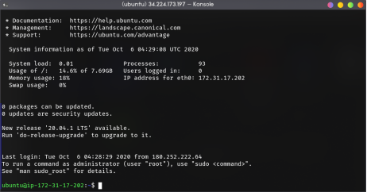

# Web app deployment automation
In this project, I was assigned to create a bash script that performs automated deployment simple web app that was created earlier.

## Table of contents
- [Web app deployment automation](#web-app-deployment-automation)
  - [Table of contents](#table-of-contents)
  - [1. Creating the Script](#1-creating-the-script)
  - [2. Running the Script](#2-running-the-script)

## 1. Creating the Script



Log in to EC2 instance, create new .sh file with prefered text editor (i use vim btw).

I will deep dive into the script i had [created](webapp-script.sh),

The first part is to prepare common dependency for web app, because i only use simple web app (html and css) i'm not installing PHP.
```bash
# Running update and upgrade
printf "\n==============> Running update & upgrade <==============\n"

sudo apt-get -y update && sudo apt-get -y dist-upgrade

# git instalation
printf "\n==============> Installing git <==============\n\n"

sudo apt-get -y install git

# apache2 instalation
printf "\n==============> Installing apache2 <==============\n\n"

sudo apt-get -y install apache2
```


## 2. Running the Script

