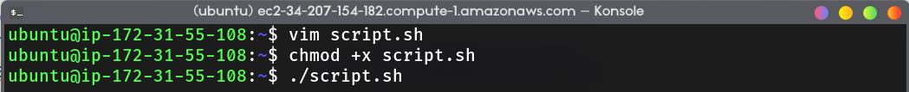
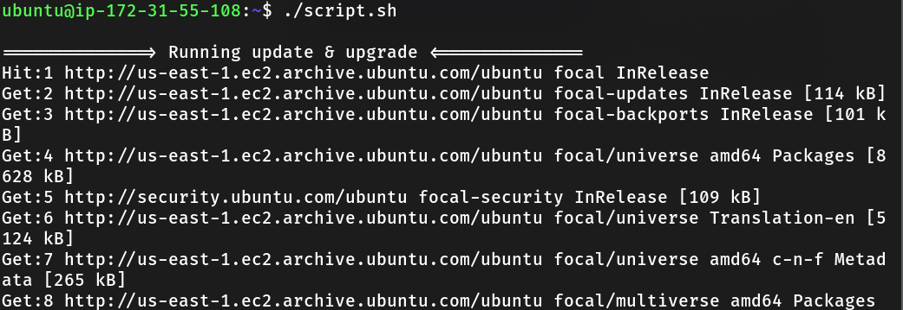
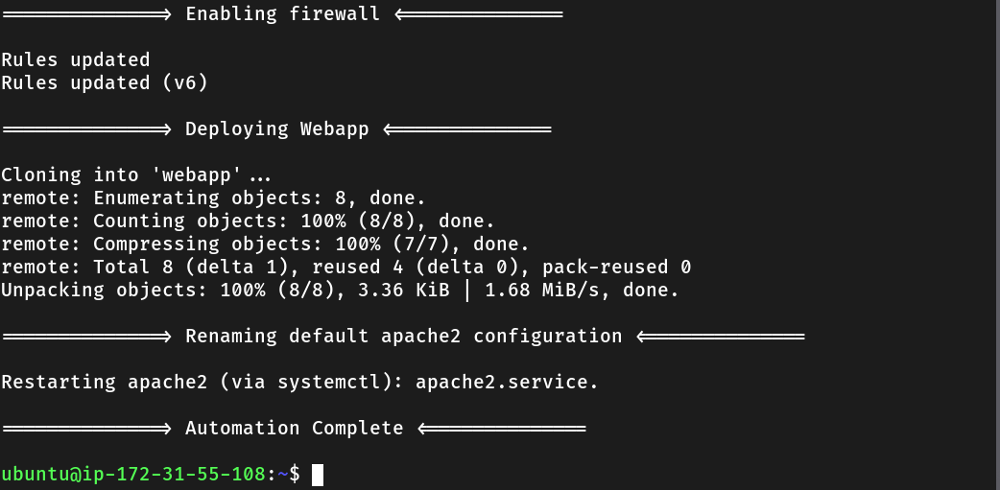
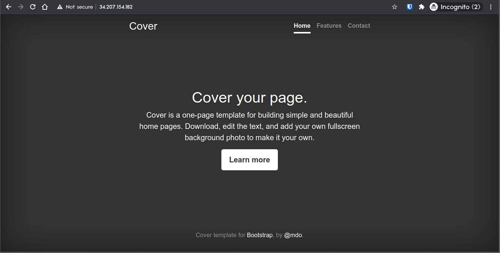

# Web app deployment automation
In this project, I was assigned to create a bash script that performs automated deployment simple web app that was created earlier.

## Table of contents
- [Web app deployment automation](#web-app-deployment-automation)
  - [Table of contents](#table-of-contents)
  - [1. Creating the Script](#1-creating-the-script)
  - [2. Running the Script](#2-running-the-script)

## 1. Creating the Script


Log in to EC2 instance with an additional rule to allow inbound connection on port 80, create new .sh file with prefered text editor (i use vim btw).

I will deep dive into the script i had [created](webapp-script.sh),

The first part is to prepare common dependency for web app, because i only use simple web app (html and css) i'm not installing PHP.
```bash
# Running update and upgrade
printf "\n==============> Running update & upgrade <==============\n"

sudo apt-get -y update && sudo apt-get -y dist-upgrade

# git instalation
printf "\n==============> Installing git <==============\n\n"

sudo apt-get -y install git

# apache2 instalation
printf "\n==============> Installing apache2 <==============\n\n"

sudo apt-get -y install apache2
```

Next, we setup a firewall using ufw. Although, this is optional because we already configure a firewall using security group.
```bash
# firewall config (optional)
printf "\n==============> Enabling firewall <==============\n\n"

# sudo ufw app list # (to view list of aplication that can be configured)
sudo ufw allow 'Apache' # allow apache
```

The next step is cloning a simple web app, for this project i use simple bootstrap website template that available on my github.

```bash
# Setup apache2 root directory
printf "\n==============> Deploying Webapp <==============\n\n"
cd /var/www

# Clone github repository
sudo git clone https://github.com/mohzulfikar/webapp.git
```

The last step is to change apache2 root directory from pointing in `/var/www/html` to the my web app directory in `/var/www/webapp`, for this purpose i use sed (stream editor) to automate replacing character in the apache2 configuration file. After that, simply restart apache and the web app should be served.

```bash
# Change apache2 root directory from /var/www/html to /var/www/webapp and restart apache2
printf "\n==============> Renaming default apache2 configuration <==============\n\n"

sudo sed -i -r 's/\/html/\/webapp/g' /etc/apache2/sites-available/000-default.conf 
sudo /etc/init.d/apache2 restart
```

## 2. Running the Script

Add execute permission and run the script.



The script should be running, wait for a while until the script finish.





