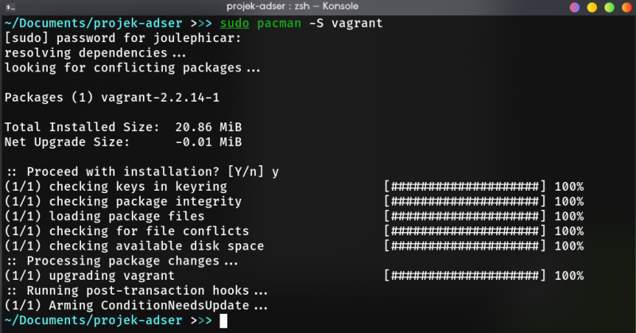
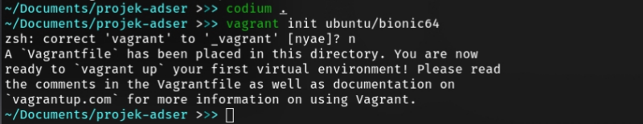
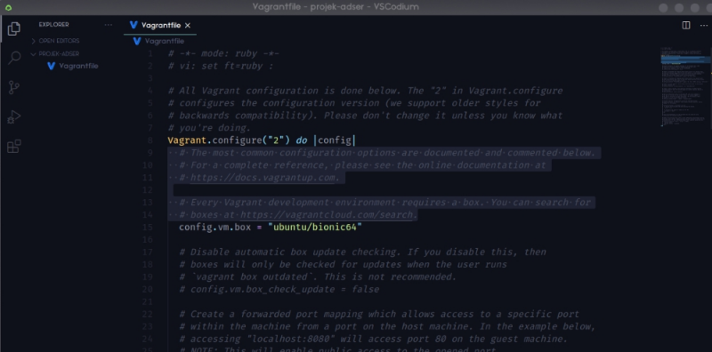
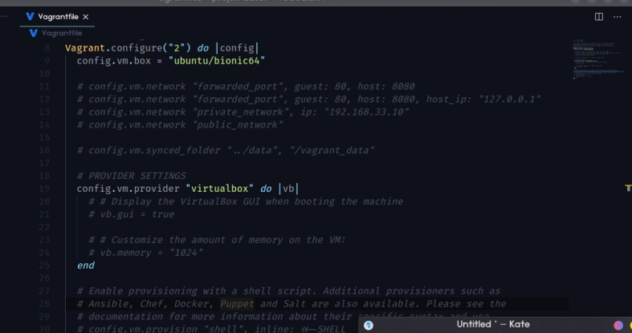
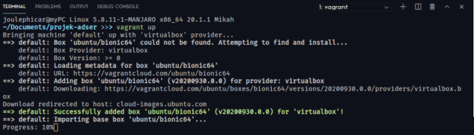
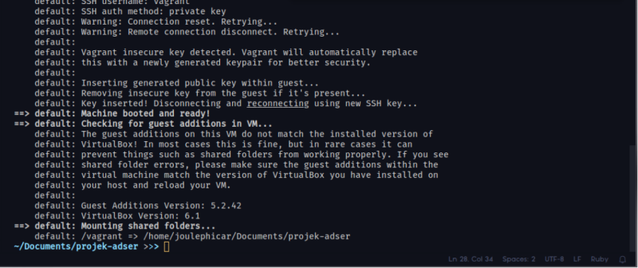
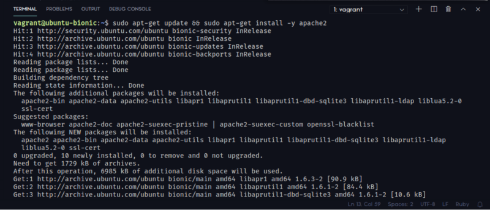
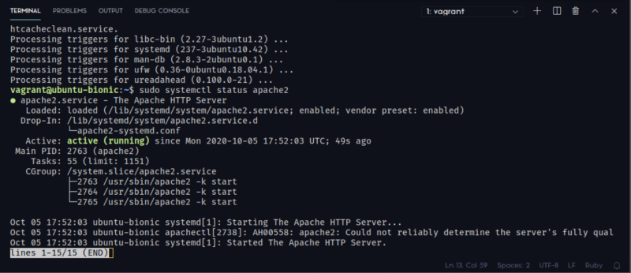
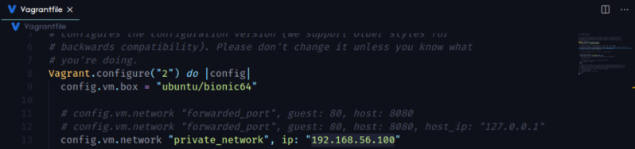

# Intro to Vagrant

In this project, I was assigned to create simple Vagrantfile for provisioning Ubuntu VM with private IP 192.168.56.100.

## Table of contents <!-- omit in toc -->

- [Intro to Vagrant](#intro-to-vagrant)
  - [1. Creating a new directory for vagrant](#1-creating-a-new-directory-for-vagrant)
  - [2. Initialize Vagrant directory](#2-initialize-vagrant-directory)
  - [3. Look at the vagrantfile configuration file](#3-look-at-the-vagrantfile-configuration-file)
  - [4. Boot Up the vm](#4-boot-up-the-vm)
  - [5. Open a ssh connection](#5-open-a-ssh-connection)
  - [6. Install apache web server](#6-install-apache-web-server)
  - [7. IP configuration](#7-ip-configuration)
  - [8. Resource(s)](#8-resources)

## 1. Creating a new directory for vagrant

Create a new directory for Vagrantfile. Here, i name it "projek adser", go to the directory and install vagrant (vagrant installation can be done before creating a directory). Because i use arch-based linux, my command for installing it would be,

```bash
sudo pacman -S vagrant
```

Wait for the installation process to complete.



## 2. Initialize Vagrant directory

Open the directory using prefered text editor (here, i use vscodium). Type this command to initialize vagrant directory (create vagrantfile) with ubuntu bionic (18.04) image.

``` bash
vagrant init ubuntu/bionic64
```



## 3. Look at the vagrantfile configuration file



We can delete the lines that are less important (for this assignment) and leave as follows,



## 4. Boot Up the vm

We can boot up the vm using,

```bash
vagrant up
```



When finished, it will look like this



## 5. Open a ssh connection

After the configuration is complete, type the command

```bash
vagrant ssh
```

to open the ssh connection from the host, we can configure vm vagrant ubuntu using this connection.

## 6. Install apache web server

Install apache on the vm via ssh connection, don't forget to update it first

```bash
sudo apt-get update && sudo apt-get -y apache2
```



Check apache2 service status with `systemctl`.

```bash
sudo systemctl status apache2
```



If the apache2 status is "active" then it means we've successfully install the webserver. If you see other status, you might've to wait a few minutes or you can try to restart the server using

```bash
$ sudo systemctl restart apache2
```

## 7. IP configuration

We can confirm that our virtual machine and webserver are running successfully. Now, logout from ssh session and back to the Vagrantfile to configure the IP to `192.168.56.100`



After that, we can reload the Vagrant configuration using,

```bash
vagrant reload
```

And then go to the IP, you should see a well-known apache2 webserver default page. You can also configure it to serve your own webapp.

## 8. Resource(s)

Here's my Vagrantfile

```ruby
# -*- mode: ruby -*-
# vi: set ft=ruby :

Vagrant.configure("2") do |config|
  config.vm.box = "ubuntu/bionic64"

  # config.vm.network "forwarded_port", guest: 80, host: 8080
  # config.vm.network "forwarded_port", guest: 80, host: 8080, host_ip: "127.0.0.1"
  config.vm.network "private_network", ip: "192.168.56.100"
  # config.vm.network "public_network"

  # PROVIDER SETTINGS
  config.vm.provider "virtualbox" do |vb|
    # # Display the VirtualBox GUI when booting the machine
    # vb.gui = true
  
    # # Customize the amount of memory on the VM:
    # vb.memory = "1024"
  end
end
```
