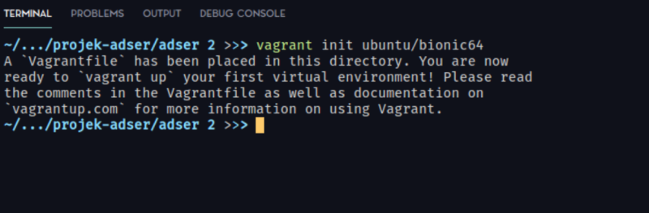

# Provisioning Webapp Using Vagrant
In this project, I was assigned to create simple Vagrantfile for serving simple webapp with bash automation (the one i created in previous project) with private IP 192.168.56.100.

## Table of contents
- [Provisioning Webapp Using Vagrant](#provisioning-webapp-using-vagrant)
  - [Table of contents](#table-of-contents)
  - [1. Initialize Vagrant](#1-initialize-vagrant)
  - [2. Script Throwback](#2-script-throwback)
  - [3. Provisioning VM and Running the Script](#3-provisioning-vm-and-running-the-script)

## 1. Initialize Vagrant

First, we can initialize vagrant directory by using `vagrant init`

```bash
vagrant init ubuntu/bionic64
```



## 2. Script Throwback

After that, we can modify our Vagrantfile to match the project specification.


## 3. Provisioning VM and Running the Script