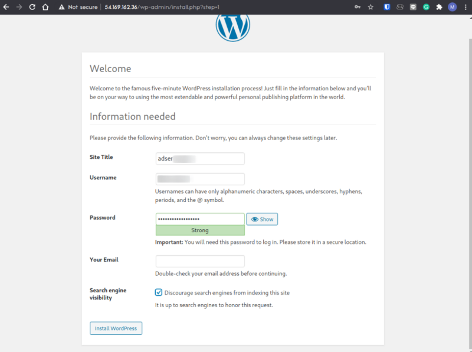
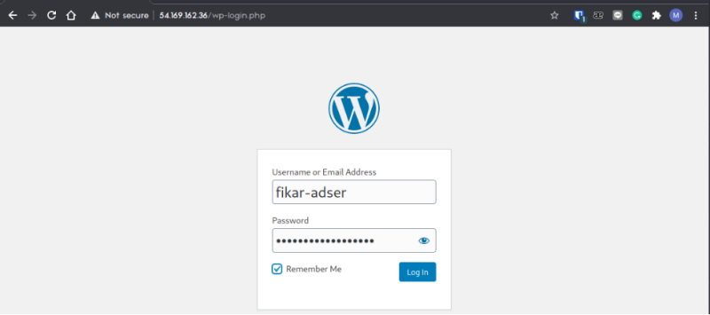
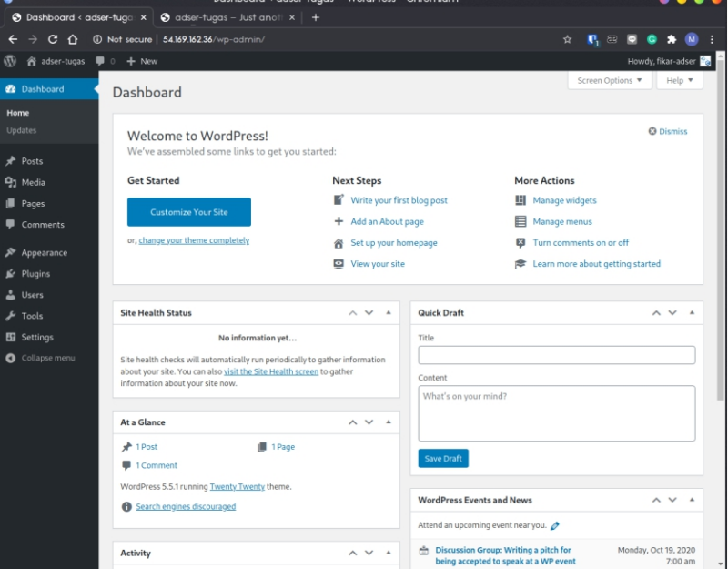
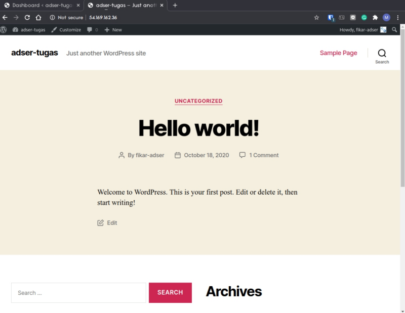

# Wordpress Deployment

In this project, I was assigned to do wordpress deployment on EC2 instance.

## Table of contents <!-- omit in toc -->

- [Wordpress Deployment](#wordpress-deployment)
  - [1. Creating the Instance](#1-creating-the-instance)
  - [2. Installing Apache, MySQL, and PHP (LAMP)](#2-installing-apache-mysql-and-php-lamp)
  - [3. Wordpress Installation and Configuration](#3-wordpress-installation-and-configuration)
  - [4. Database Configuration](#4-database-configuration)
  - [5. Finishing the Instalation](#5-finishing-the-instalation)
  - [6. Wordpress Blog Setup](#6-wordpress-blog-setup)
  - [7. The Script](#7-the-script)

## 1. Creating the Instance

Choose Ubuntu 18.04 AMI, don't forget to set the security group with an additional rule to allow inbound connection on port 80 (well, actually i think we should learn how to automate this in the future).


Open SSH connection to the server.


The command i run on the screenshot is to set database name environtment variable for wordpress. Do the following command to initialize setup.

```bash
export wordpress_db_name="your_wpdb_name"
```

```bash
export db_root_password="your_wpdb_password"
```

Please take a note that you MUST NOT do this (specify the password in plaintext) in the production environtment.

And then, update the instance


## 2. Installing Apache, MySQL, and PHP (LAMP)

Install the webserver, database, and PHP with the following command

```bash
# Installing apache2
$ sudo apt-get install apache2 apache2-utils -y  
$ sudo systemctl start apache2  
$ sudo systemctl enable apache2  

# Installing php and the required library
$ apt-get install php libapache2-mod-php php-mysql -y

# Installing mysql with the environtment variable provided before
$ sudo debconf-set-selections <<< "mysql-server mysql-server/root_password password $db_root_password"
$ sudo debconf-set-selections <<< "mysql-server mysql-server/root_password_again password $db_root_password"
$ sudo apt-get install mysql-server mysql-client -y 
```

## 3. Wordpress Installation and Configuration

To get the wordpress webapp, simply curl or get the latest version of wordpress from [wordpress.org](http://wordpress.org/latest.tar.gz) and extract it to the specified directory

```bash
$ sudo rm /var/www/html/index.*
$ sudo curl -L http://wordpress.org/latest.tar.gz --output wordpress.tar.gz
$ sudo tar -xzf wordpress.tar.gz

# Copy the wordpress webapp to www/html with rsync
$ sudo rsync -a wordpress/* /var/www/html/

# Change the ownership
$ sudo chown -R www-data:www-data /var/www/html/  
$ sudo chmod -R 755 /var/www/html/  
```

The question is, why i use `rsync` instead of regular `cp` command? Well, `rsync -a` or archive mode is one of many ways to copy one file or directory with preserving the metadata of the file itself (date, owner, etc.).

## 4. Database Configuration

The next step is connecting the database to our wordpress. We can achive this by using the following command

```bash
$ sudo mysql -u root -p$db_root_password <<QUERY_INPUT
CREATE DATABASE $wordpress_db_name;
GRANT ALL PRIVILEGES ON $wordpress_db_name.* TO 'root'@'localhost' IDENTIFIED BY '$db_root_password';
FLUSH PRIVILEGES;
EXIT
QUERY_INPUT 
```

The above command simply said to create new database and grant the privileges of modifying that database to root with specified password. Of course, **WE CAN ONLY** do this on development environtment 🙂. In the production, we can create new user and grant the database previleges to that user.

After that, we can configure wp-config.php to specify our database name and password.

```bash
$ cd /var/www/html/
$ sudo mv wp-config-sample.php wp-config.php

# Replace some value with stream editor
$ sudo sed -i -r "s/database_name_here/$wordpress_db_name/g" wp-config.php
$ sudo sed -i -r "s/username_here/root/g" wp-config.php
$ sudo sed -i -r "s/password_here/$db_root_password/g" wp-config.php
```

As you can see, we can automate to replace file content with stream editor. You can check the man pages for more details.

## 5. Finishing the Instalation

Install required module for php and apache2

```bash
$ sudo a2enmod rewrite  

# mcrypt in php7 by default isn't supported
$ sudo php5enmod mcrypt
```

Don't forget to installing phpmyadmin for managing your database (optional). If there's a popup open, choose apache2.

```bash
# Install and configure phpmyadmin
$ sudo apt-get install phpmyadmin -y
$ echo 'Include /etc/phpmyadmin/apache.conf' >> /etc/apache2/apache2.conf
```


Finally, restart apache and mysql service and clean up downloaded file (wordpress.tar.gz)

```bash
cd $home
sudo rm -rf wordpress.tar.gz wordpress
```

## 6. Wordpress Blog Setup

Visit the instance IP and you should see wordpress installation page as follow,


Create new user and password for your wordpress


Login to the wp-admin page with previous credential



You should see wp-admin dashboard page, here you can manage your wordpress site interactively and install additional plugin.



You can visit the IP once again to see the default looks of the website.



Take a note that, i'm running the wordpress 5.5.1, should you see some difference in the default look is probably because you installed a different version of WordPress (the latest version now as i wrote this is 5.6), you can change it on wp-admin page.

## 7. The Script

You can see my script on this [link](script.sh)
