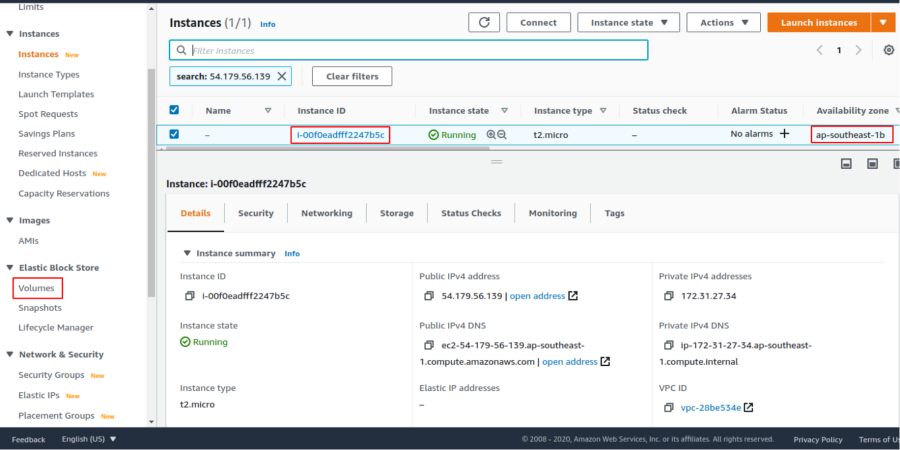
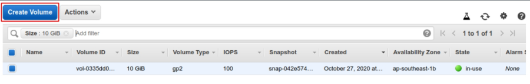
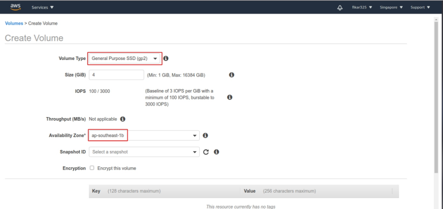
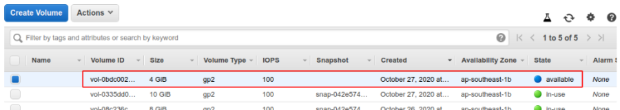
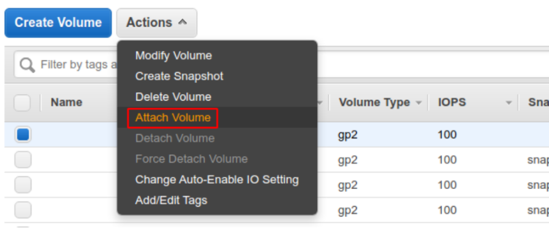
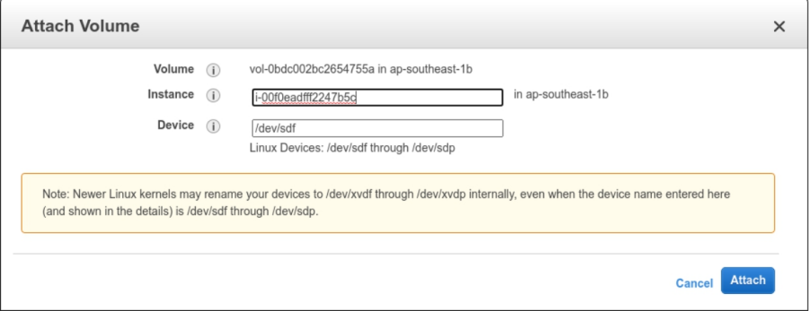
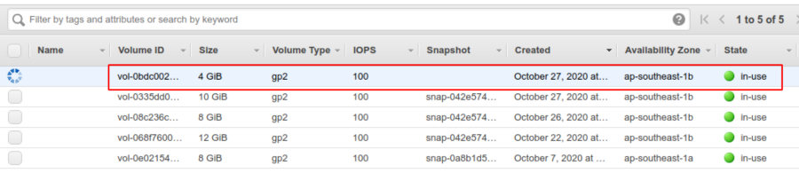
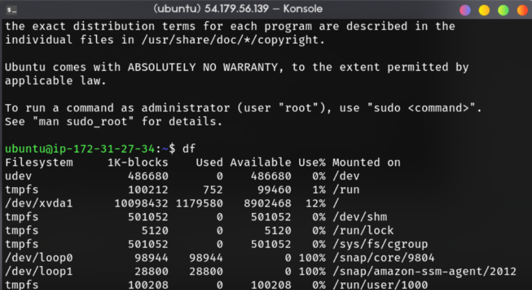
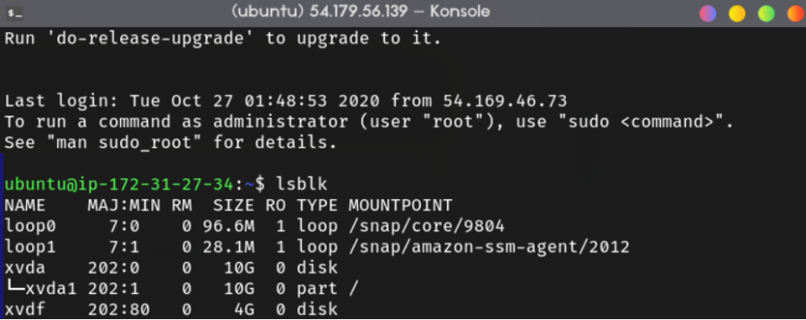

# Intro to Vagrant
In this project, I was assigned to create EC2 instance with 10GB SSD and attach an additional EBS volume into the instance.

## Table of contents
- [Intro to Vagrant](#intro-to-vagrant)
  - [Table of contents](#table-of-contents)
  - [1. Preparing the Needed](#1-preparing-the-needed)
  - [2. Creating New Volume](#2-creating-new-volume)
  - [3. Attaching the Volume](#3-attaching-the-volume)
  - [4. Creating a Filesystem](#4-creating-a-filesystem)

## 1. Preparing the Needed

Go to the EC2 dashboard, select the instance that we will attach new volume into. There are 2 information that must be noted, the first is the _instance ID_ the second one is _availability zone_.

After that, on the navigation pane, select _Volume_ on _elastic block store_ section.



## 2. Creating New Volume

In the EBS volume dashboard, click "Create Volume" and create new volume as desired. Here, in my case i create new volume with 4GiB with SSD gp2 type. Take a note that availability zone for the volume MUST be same as the target instance (ap-southeast-1b in my case).





If successful, the new volume will appear on the EBS dashboard with a state / status available.




## 3. Attaching the Volume

Right click on the volume and select attach volume.



There will be a popup to choose the instance, recall the ID we noted before and select the instance. For the device name, we can leave as it is or change to `/dev/sdf`, `/dev/sdg`, or whatever. Click "Attach" to attach the volume.



Wait for a while until the volume state changed to "in-use" with little green circle.



## 4. Creating a Filesystem

Run the `df` command to see if the volume already exists on that instance. 



As you can see, the volume we added is not visible yet. This is because we haven't done formatting and mounting the new volume. Although, we can actually see all filesystem including volume / disk that are not mounted yet with command,

```bash
$ df -aH
```

We can also see all *storage* that had been attached on the instance using command,

```bash
$ lsblk
```

We can see there's one disk named xvdf with 4G of size (which is the volume that we created earlier).



Before *mounting* the new volume, look at the filesystem of the new volume by typing the command,

```bash
$ sudo file -s /dev/xvdf
```

Then, look at the root partition filesystem with the command

