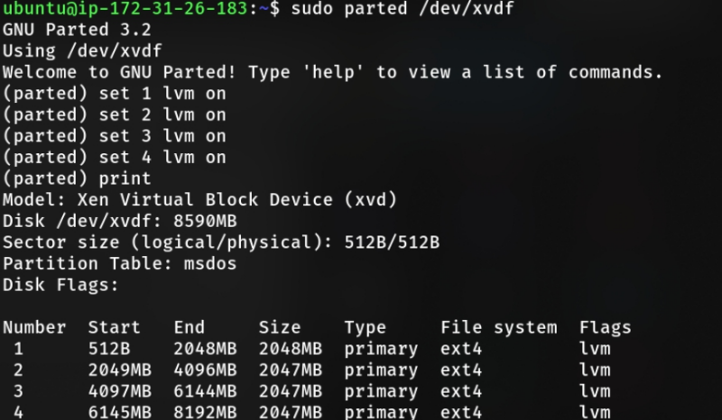

# LVM on AWS EC2

In this project, I was assigned to create LVM on EC2 instance 10GB capacity consist of 2 EBS volume that have 4 partition with 2GiB size each (In short, i should create LVM consist of 5 partition).

## Table of contents <!-- omit in toc -->

- [LVM on AWS EC2](#lvm-on-aws-ec2)
  - [1. Creating New Volume](#1-creating-new-volume)
  - [2. Creating Partition](#2-creating-partition)
  - [3. Creating the LVM](#3-creating-the-lvm)
    - [Creating Physical Volume](#creating-physical-volume)
    - [Creating Volume Group](#creating-volume-group)
    - [Creating Logical Volume](#creating-logical-volume)
    - [Mounting the Logical Volume](#mounting-the-logical-volume)
  - [4. Make it Persist](#4-make-it-persist)

## 1. Creating New Volume

Like before, create 2 new EBS Volume (8 GiB each).


Attach the new volume to an instance.


Run `lsblk` command to see list of attached disk.


## 2. Creating Partition

Create new partition using `parted`. Assign `msdos` label and set it to become *primary partition*. For the filesystem, type `ext4`. The start position on 1st partition should be 0 until 2048MB, then 2049MB to 4096MB, 4097MB to 6144MB, and the last one 6145MB to 8192MB.


Type `print` on parted console and we should see the following table.


Exit parted and format the previously created partition into ext4 filesystem using `mkfs`.


> if you had trouble finding the correct name for device, just type `lsblk` or `df -aH` (or just find the disk name and add number after it 1, 2, 3, and 4).

Repeat the step for the second disk and the final result should look like this,


## 3. Creating the LVM

Install `lvm2` and make sure to start `dm-mod` kernel module,

```bash
sudo apt-get install lvm2 -y
sudo modprobe dm-mod
```

### Creating Physical Volume

Create 2 physical volume for all partition in disk 1 and disk 2 using command,

```bash
$ sudo parted /dev/xvdf
(parted) set [partitionNumber] lvm on
```



And then use `pvcreate` to create physical volume.


### Creating Volume Group

Repeat the step for the other disk and then create a volume group with the 8 partition we created before.

```bash
sudo vgcreate [nameOfVolumeGroup] /dev/[partition1] /dev/[partition2] ...
```

The final result should look like this.


### Creating Logical Volume

Create a logical volume with 10GiB in size,

```bash
sudo lvcreate -L 10GB [nameOfVolumeGroup] -n lv1
sudo lvdisplay
```


Type `lsblk` to see what partition included on that 10GB logical volume.


Format the logical volume to ext4 filesystem with `mkfs`.


### Mounting the Logical Volume

Mount the lvm to check if we successfully creating the logical volume. Don't forget to change the ownership of mount directory to make the directory accessible without root previledges.


Run `df -H` to see if the logical volume we created before is displayed instead of 2 disk we attached before.


> As you can see, we've successfully mounted the lvm.

## 4. Make it Persist

As you can see, we haven't setup the LVM to be auto-mounted on boot, meaning that we must manually mount LVM each time we start the machine. To make it persist, we can **add it into /etc/fstab file**. If you don't know what /etc/fstab is, you can read [this good article](https://www.redhat.com/sysadmin/etc-fstab) from redhat.

After you know about what /etc/fstab actually is, you can just run this command,

```bash
sudo bash -c 'echo /dev/[volumeGroupName]/[logicalVolumeName] /path/to/mount/your/lvm ext4 defaults 0 0 >> /etc/fstab'
```

Voila! now try to restart your machine, the lvm should now be automatically mounted on your desired path.
