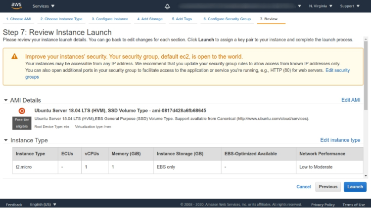

# DNS Server with EC2

In this project, I was assigned to create DNS server with EC2 instance with group of 3 students.

This is basically a team project, i teamed up with [Fikri](wuvel.net) and [Rafi](rafifauz.site). Also, i actually have to redo the assignment because our submission is not actually what the project intended too (we don't delegate zone, thus we basically just add A record on our DNS record). I also read [this](https://badshah.io/how-i-hosted-a-dns-server-on-aws/) and [this](https://www.digitalocean.com/community/tutorials/
how-to-configure-bind-as-a-private-network-dns-server-on-ubuntu-18-04) guide for this project. You should see their website too! :)

## Table of contents  <!-- omit in toc -->

- [DNS Server with EC2](#dns-server-with-ec2)
  - [1. Setup EC2 with Elastic IP](#1-setup-ec2-with-elastic-ip)
    - [Launch an Instance](#launch-an-instance)
    - [Allocate Elastic IP](#allocate-elastic-ip)
    - [Associate Elastic IP](#associate-elastic-ip)
  - [2. Setup Authoritative Name Server](#2-setup-authoritative-name-server)
    - [Bind9 Installation](#bind9-installation)
    - [Configuration](#configuration)
  - [3. Delegate New Zone](#3-delegate-new-zone)
    - [Setup Personal/Private DNS Server](#setup-personalprivate-dns-server)
    - [Add NS Record](#add-ns-record)
    - [Setup Database File](#setup-database-file)
    - [Create Log File (Optional)](#create-log-file-optional)

## 1. Setup EC2 with Elastic IP

Launch an EC2 instance and attach Elastic IP to it. Here's step-by-step to attach Elastic IP to an instance if you want  refresher.

### Launch an Instance

In this example, i use t2.micro which is available for free-tier usage. For the image, i use ubuntu 18.04.



> A quick note here, make sure you have proper security group configuration (open ports for DNS, etc.)

### Allocate Elastic IP

There's 2 step for attaching elastic IP to an instance, the first is to "allocate" or get an IP from amazon's pool of IPv4 addresses and then we "associate" the IP to the instance. To allocate elastic IP, look at EC2 dashboard in the "Network & Security" category, select "Elastic IPs".


As you can see, we're provided with many option here. For *Network Border Group*, choose one that are line-up with your instance location (in my case is us-east-1), then click "Allocate".


### Associate Elastic IP

After we successfully allocate an IP, we can associate it. Click on the IP we allocated before, select "Actions" button on the top, select "Associate Elastic IP address". Then, select the correct instance ID, click "Associate".


Elastic IP has been successfully associated. Note the IP because we use that later.


## 2. Setup Authoritative Name Server

### Bind9 Installation

SSH to the instance we created and install bind9, bind9utils, and bind9-doc.

```bash
sudo apt install bind9 bind9utils bind9-doc -y
```


After that, check if bind9 *service* is running and then enable the service using `systemctl`.

```bash
sudo systemctl status bind9
sudo systemctl enable bind9
```


### Configuration

There's 3 file that we need to look at and configure, the first one is `named.conf.option` located at `/etc/bind/`. In this case, i don't modify the file but if you want, you can add ACL block.

The second file is at `/etc/bind/named.conf.local`, create new zone block you want to delegate to this DNS Server. For example, in this case i create new zone called `delegated.mohzulfikar.me`. Something to take a note here, you can have custom name for zone, but it's considered a best practice if you name it to match the subdomain. For the file location, it's also a best practice to follow subdomain name with `db` prefix.

```bash
zone "delegated.mohzulfikar.me" {
        type master;
        file "/etc/bind/db.delegated.mohzulfikar.me";
};
```


For the third file, you must create it first according to the database filename in previous file configuration. You can copy from the template provided from bind.

```bash
sudo cp /etc/bind/db.empty /etc/bind/db.delegated.mohzulfikar.me
```

## 3. Delegate New Zone

### Setup Personal/Private DNS Server

Before continue to create zone, we must configure custom DNS for our domain first. Just go to your domain dashboard and create new personal dns server first and write the ELASTIC_IP that we associate before (for the nameserver, you can just use ns1 or ns2 or whatever available).


> I use namecheap for managing my domain, there may be a little difference in the other provider.

### Add NS Record

The next step is add new NS record. Why? Because i only delegate `delegated.mohzulfikar.me` to `ns1` nameserver i created before, so i must tell my DNS management (mohzulfikar.me) to points the management of `delegated.mohzulfikar.me` subdomain to `ns1` nameserver.


> BTW, I use cloudflare for managing my DNS

### Setup Database File

After that, we will change the database file. First, let's have a look on the `SOA` part. You can change the serial, i changed it to 4.

Then, add `NS` and starter `A` records pointing at your desired host.

```bash
@       IN      SOA     ns1.mohzulfikar.me. admin.delegated.mohzulfikar.me. (
                              3         ; Serial
                         604800         ; Refresh
                          86400         ; Retry
                        2419200         ; Expire
                          86400 )       ; Negative Cache TTL
;
        IN      NS      ns1.mohzulfikar.me.

dev.delegated.mohzulfikar.me.   IN      A       54.OOO.OOO.OOO # replace with your host IP
test.delegated.mohzulfikar.me.  IN      A       54.OOO.OOO.OOO # replace with your host IP
```

### Create Log File (Optional)

To help with troubleshoot, you can create, format, reformat the log file of bind9 with the following command. The following command is from [this](https://badshah.io/how-i-hosted-a-dns-server-on-aws/#setting-up-the-dns-server) site, don't forget to check their website too.

```bash
echo 'include "/etc/bind/named.conf.log";' >> /etc/bind/named.conf
```

Then, create `named.conf.log` with the following content,
