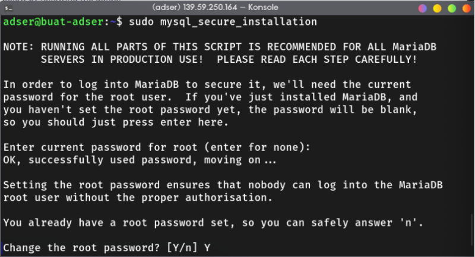
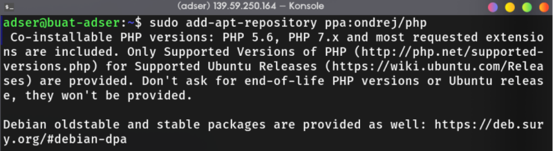
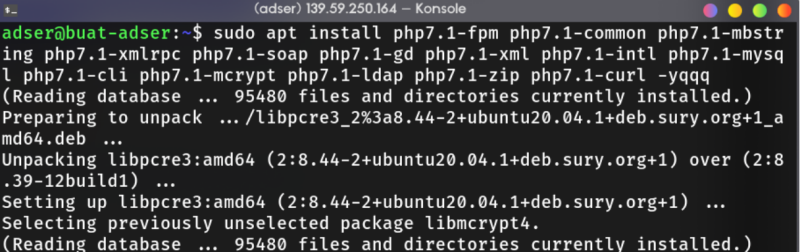

# Host Multiple Wordpress Site in EC2

In this project, I was assigned to leverage NGINX server block to host multiple wordpress site on the same EC2 instance And one of the site must be served with HTTPS. Like the previuos project, this is also a team project feat [Fikri](wuvel.net) and [Rafi](rafifauz.site).

## Table of contents <!-- omit in toc -->

- [Host Multiple Wordpress Site in EC2](#host-multiple-wordpress-site-in-ec2)
  - [1. EMP Installation](#1-emp-installation)
    - [Install NGINX](#install-nginx)
    - [Install Database Server and Client](#install-database-server-and-client)
    - [Install PHP 7](#install-php-7)
  - [2. EMP Configuration](#2-emp-configuration)
    - [MariaDB](#mariadb)

## 1. EMP Installation

So what's EMP or LEMP? It's an abbrevation of Linux, NGINX (Engine-X), MySQL (or MariaDB), and PHP. Basically, it's one of the popular [*Tech Stack*](https://stackshare.io/stacks) used to build web application. The installation is very straight-forward in Ubuntu. First, update the repository database and upgrade.

```bash
sudo bash -c "apt update && apt dist-upgrade -yq && apt autoremove"
```

### Install NGINX

Install NGINX and enable it using `systemctl` command,

```bash
sudo apt install nginx -yqq
sudo systemctl enable nginx.service
sudo systemctl status nginx.service # make sure that nginx
                                    # have "running" status
```

### Install Database Server and Client

Install mariadb server and client,

```bash
sudo apt install mariadb-server mariadb-client -yqq
sudo systemctl enable mysql.service
sudo systemctl status mysql.service # check mysql status
```

Start MySQL secure installation, secure installation have several functions,

1. Delete Anonymous users
2. Remove Remote root Login
3. Delete test database and it's access
4. Reload privilege tables

```bash
sudo mysql_secure_installation
```



Restart MariaDB (or MySQL),


### Install PHP 7

Add ppa php ondrej repository into ubuntu.

```bash
sudo add-apt-repository ppa:ondrej/php
```



Install PHP 7.1 (you can adjust the version if there's newer release) and the [required/recommended extensions](https://make.wordpress.org/hosting/handbook/handbook/server-environment/).

```bash
sudo apt install php7.1-common php7.1-fpm php7.1-mbstring php7.1-xmlrpc php7.1-soap php7.1-gd php7.1-xml php7.1-intl php7.1-mysql php7.1-cli php7.1-mcrypt php7.1-ldap php7.1-zip php7.1-curl -yqqq
```




## 2. EMP Configuration

### MariaDB

Login to mysql root user to create database for wordpress, don't forget to take a note about database user, password, and database name. Also, `FLUSH PRIVILEGES` before you exit the mariadb console.

```bash
sudo mysql -u root -p
```

```SQL
MariaDB > CREATE DATABASE db_name_for_first_wp_site;
MariaDB > CREATE DATABASE db_name_for_second_wp_site;

MariaDB > GRANT ALL ON db_name_for_first_wp_site.* TO 'db_user_for_first_wp_site'@'localhost' IDENTIFIED BY 'your_password';

MariaDB > GRANT ALL ON db_name_for_second_wp_site.* TO 'db_user_for_second_wp_site'@'localhost' IDENTIFIED BY 'your_password';

MariaDB > FLUSH PRIVILEGES;

MariaDB > exit;
```
