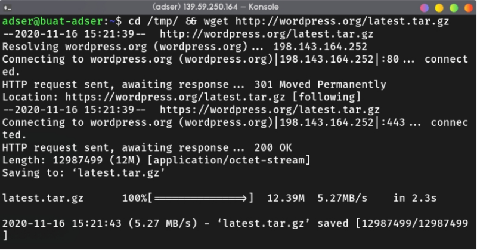

# Host Multiple Wordpress Site in EC2

In this project, I was assigned to leverage NGINX server block to host multiple wordpress site on the same EC2 instance And one of the site must be served with HTTPS. Like the previuos project, this is also a team project feat [Fikri](wuvel.net) and [Rafi](rafifauz.site).

## Table of contents <!-- omit in toc -->

- [Host Multiple Wordpress Site in EC2](#host-multiple-wordpress-site-in-ec2)
  - [1. EMP Installation](#1-emp-installation)
    - [Install NGINX](#install-nginx)
    - [Install Database Server and Client](#install-database-server-and-client)
    - [Install PHP 7](#install-php-7)
  - [2. EMP Configuration](#2-emp-configuration)
    - [MariaDB](#mariadb)
    - [NGINX](#nginx)
      - [Sites Available](#sites-available)
      - [Sites Enabled](#sites-enabled)
      - [Creating Wordpress Application Directory](#creating-wordpress-application-directory)
  - [3. Wordpress Configuration](#3-wordpress-configuration)
    - [Download Wordpress](#download-wordpress)
    - [Wordpress Configuration](#wordpress-configuration)
    - [Verify Your Configuration](#verify-your-configuration)

## 1. EMP Installation

So what's EMP or LEMP? It's an abbrevation of Linux, NGINX (Engine-X), MySQL (or MariaDB), and PHP. Basically, it's one of the popular [*Tech Stack*](https://stackshare.io/stacks) used to build web application. The installation is very straight-forward in Ubuntu. First, update the repository database and upgrade.

```bash
sudo bash -c "apt update && apt dist-upgrade -yq && apt autoremove"
```

### Install NGINX

Install NGINX and enable it using `systemctl` command,

```bash
sudo apt install nginx -yqq
sudo systemctl enable nginx.service
sudo systemctl status nginx.service # make sure that nginx
                                    # have "running" status
```

### Install Database Server and Client

Install mariadb server and client,

```bash
sudo apt install mariadb-server mariadb-client -yqq
sudo systemctl enable mysql.service
sudo systemctl status mysql.service # check mysql status
```

Start MySQL secure installation, secure installation have several functions,

1. Delete Anonymous users
2. Remove Remote root Login
3. Delete test database and it's access
4. Reload privilege tables

```bash
sudo mysql_secure_installation
```


Restart MariaDB (or MySQL),


### Install PHP 7

Add ppa php ondrej repository into ubuntu.

```bash
sudo add-apt-repository ppa:ondrej/php
```


Install PHP 7.1 (you can adjust the version if there's newer release) and the [required/recommended extensions](https://make.wordpress.org/hosting/handbook/handbook/server-environment/).

```bash
sudo apt install php7.1-common php7.1-fpm php7.1-mbstring php7.1-xmlrpc php7.1-soap php7.1-gd php7.1-xml php7.1-intl php7.1-mysql php7.1-cli php7.1-mcrypt php7.1-ldap php7.1-zip php7.1-curl -yqqq
```


## 2. EMP Configuration

### MariaDB

Login to mysql root user to create database for wordpress, don't forget to take a note about database user, password, and database name. Also, `FLUSH PRIVILEGES` before you exit the mariadb console.

```bash
sudo mysql -u root -p
```

```SQL
MariaDB > CREATE DATABASE db_name_for_first_wp_site;
MariaDB > CREATE DATABASE db_name_for_second_wp_site;

MariaDB > GRANT ALL ON db_name_for_first_wp_site.* TO 'db_user_for_first_wp_site'@'localhost' IDENTIFIED BY 'your_password';

MariaDB > GRANT ALL ON db_name_for_second_wp_site.* TO 'db_user_for_second_wp_site'@'localhost' IDENTIFIED BY 'your_password';

MariaDB > FLUSH PRIVILEGES;

MariaDB > exit;
```


> Pro tip: don't forget to add semicolon for each SQL command :)

### NGINX

#### Sites Available

Create two files in `/etc/nginx/sites-available` directory. It's considered a best practice to create with the domain name we want to use (for example wp-site.example.com).


For each of the file, you can configure it like this

```nginx
server {
    listen 80;
    listen [::]:80;
    root /var/www/html/websatu.wuvel.net; # replace this with 
                                          # your wp location
    index  index.php index.html index.htm;
    server_name  websatu.wuvel.net; # replace with your domain

    client_max_body_size 100M;

    location / {
        try_files $uri $uri/ /index.php?$args;
    }

    location ~ \.php$ {
    include snippets/fastcgi-php.conf;
    fastcgi_pass             unix:/var/run/php/php7.1-fpm.sock;
    fastcgi_param   SCRIPT_FILENAME $document_root$fastcgi_script_name;
    }
}
```

#### Sites Enabled

After that, enable each of the server block by soft link it to the `/etc/nginx/sites-enabled/` directory.

```bash
sudo ln -s /etc/nginx/sites-available/your.website.com /etc/nginx/sites-enabled
```


#### Creating Wordpress Application Directory

Create the directory to store the wordpress,

```bash
sudo mkdir -p /var/www/html/your.website.com
```


## 3. Wordpress Configuration

### Download Wordpress

Download Wordpress from this [link](https://wordpress.org/latest.tar.gz). After that, extract it using `tar` and copy it to the directory we created before.

```bash
tar -xzf latest.tar.gz
sudo cp -R wordpress/* /var/www/html/your.website.com
```




### Wordpress Configuration

Before we use wordpress, we must configure

1. Database Name
2. Database User
3. Password Database User
4. Database Host
5. Database Charset

You can copy `wp-config-sample.php` provided in wordpress app root directory and renamne it to `wp-config.php`

```bash
sudo cp /var/www/html/yoursite.com/wp-config-sample.php /var/www/html/yoursite.com/wp-config.php
```

Here's my example configuration


Lastly, change the ownership of your wordpress app directory to www-data or the webserver user.

```bash
sudo chown -R www-data:www-data /var/www/html
sudo chmod -R 755 /var/www/html
```

### Verify Your Configuration

Verify your nginx setting we created earlier and restart the nginx service.

```bash
sudo nginx -t
sudo systemctl restart nginx
```


