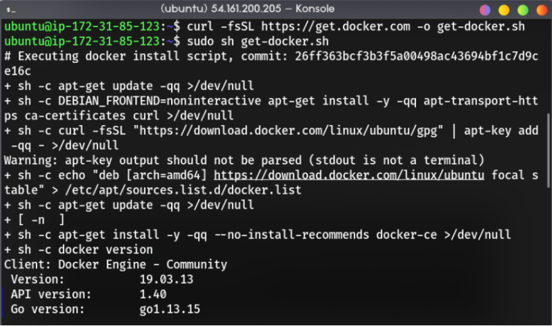

# Deploy Wordpress using Docker Compose

In this project, I was assigned to deploy wordpress by using docker-compose. The compose file must contain two services (wordpress and database) and the service must be able to communicate each other.

## Table of contents <!-- omit in toc -->

- [Deploy Wordpress using Docker Compose](#deploy-wordpress-using-docker-compose)
  - [1. Docker and Docker Compose Installation](#1-docker-and-docker-compose-installation)

## 1. Docker and Docker Compose Installation

First, install docker with the script that docker provided to us in [this link](https://get.docker.com).

```bash
curl -fsSL https://get.docker.com -o get-docker.sh
sudo sh get-docker.sh
```


