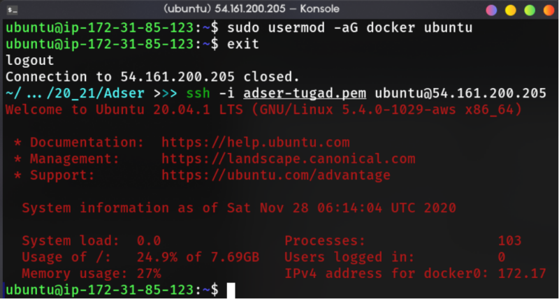

# Deploy Wordpress using Docker Compose

In this project, I was assigned to deploy wordpress by using docker-compose. The compose file must contain two services (wordpress and database) and the service must be able to communicate each other.

## Table of contents <!-- omit in toc -->

- [Deploy Wordpress using Docker Compose](#deploy-wordpress-using-docker-compose)
  - [1. Docker and Docker Compose Installation](#1-docker-and-docker-compose-installation)
  - [2. Configuring Docker Compose](#2-configuring-docker-compose)

## 1. Docker and Docker Compose Installation

First, install docker with the script that docker provided to us in [this link](https://get.docker.com).

```bash
curl -fsSL https://get.docker.com -o get-docker.sh
sudo sh get-docker.sh
```


After that, add current user to docker group, exit the current session, and reconnect to SSH (this need to be done).

```bash
sudo usermod -aG docker ubuntu
```



Create new directory for the project and install docker-compose with `apt`.

```bash
sudo apt install docker-compose -yqqq
```

## 2. Configuring Docker Compose

Create new compose file named `docker-compose.yml` with two service (wordpress and mysql).

```yml
version: '3'

services:
   db:
       image: mysql:8.0
       volumes:
        - db_data:/var/lib/mysql
       restart: always
       environment:
          MYSQL_ROOT_PASSWORD: password-adser-wp123
          MYSQL_DATABASE: wordpress
          MYSQL_USER: wp-adser
          MYSQL_PASSWORD: wp-adser123
       ports:
        - "3306:3306"

   wordpress:
       depends_on:
        - db
       image: wordpress:latest
       restart: always
       environment:
          WORDPRESS_DB_HOST: db
          WORDPRESS_DB_USER: wp-adser
          WORDPRESS_DB_PASSWORD: wp-adser123
          WORDPRESS_DB_NAME: wordpress
       ports:
        - "80:80"

volumes:
    db_data: {}
```
