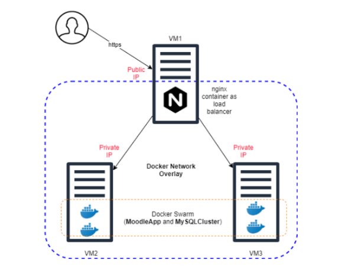

# Server and System Administration

> This repository contains projects I worked on from my "Server and Systems Administration" course.

## Table of Contents <!-- omit in toc -->

- [Server and System Administration](#server-and-system-administration)
  - [List of Project(s)](#list-of-projects)
    - [[01] Intro to Cloud Computing (AWS)](#01-intro-to-cloud-computing-aws)
    - [[02] Scripting (Bash)](#02-scripting-bash)
    - [[03] Virtualization (Virtualbox & Vagrant)](#03-virtualization-virtualbox--vagrant)
    - [[04] Storage (LVM)](#04-storage-lvm)
    - [[05] DNS (bind9)](#05-dns-bind9)
    - [[06] Web Server (NGINX)](#06-web-server-nginx)
    - [[07] Container (Docker)](#07-container-docker)
    - [[08] Container Orchestration & High Availability (Docker Swarm)](#08-container-orchestration--high-availability-docker-swarm)
    - [[Mid] Mid-term Project](#mid-mid-term-project)
    - [[Fin] Final Project](#fin-final-project)

## List of Project(s)

### [01] Intro to Cloud Computing (AWS)

> In this project, I was introduced to the AWS cloud environment. Starting from how to create an awseducate account to creating an ec2 instance. Visit [this link](01-intro/README.md)

### [02] Scripting (Bash)

> There are 2 projects in this material. The first is about automation of directory creation and the second is about creating simple script for automatic web app deployment. Visit [this link](02-scripting/README.md)

### [03] Virtualization (Virtualbox & Vagrant)

> There are 3 projects in this material. The first is about installation of apache web server on ubuntu using vagrant, the second is runninng the script that was created in the previous project (automatic web app deployment) with vagrant, and the third is manual deployment of wordpress on EC2. Visit [this link](03-virtualization/README.md)

### [04] Storage (LVM)

> There are 2 projects in this material. The first is about attaching and mounting additional EBS volume into EC2 and the second is managing storage on EC2 by creating Logical Volume. Visit [this link](04-storage/README.md)

### [05] DNS (bind9)

> The project in this material is about setup and configuring DNS server on EC2. Visit [this link](05-dns/README.md)

### [06] Web Server (NGINX)

> The project in this material is about setup and configuring 2 wordpress site using NGINX web server, with additional condition that one of the two site using HTTPS and the 2 sites must on the same EC2 instance (using NGINX server block). Visit [this link](06-webserver/README.md)

### [07] Container (Docker)

> The project in this material is to create 2 container (wordpress and mysql) and connect them either by using docker compose or manually. Visit [this link](07-container/README.md)

### [08] Container Orchestration & High Availability (Docker Swarm)

> The project in this material is to create a swarm with 3 node (1 manager). The swarm then must run a wordpress service with 5 replicas and also with database (2 replicas at minimum). Visit [this link](08-orchestration/README.md)

### [Mid] Mid-term Project

> The project is about configuring Moodle using AWS EC2 with 2 instance :
>
> - First instance EC2 as a nginx webserver
> - Second instance EC2 as a database server
> - The site must have HTTPS
> - The site must use a domain provided on the spreadsheet (or custom)

### [Fin] Final Project

> The project is about implementing high availability concept.
> 
> Student must create an environment with a configured network topology of the system that can be seen in the image above.
>
> - Create 1 EC2 instance t2.micro (VM1) as host to nginx container (load balancer)
> - Create 2 EC2 instance t2.medium (VM2 and VM3) as docker swarm node (host of moodle and database cluster)
> - Configure Nginx load balancer with HTTPS. An example of configuration file can be seen on the following [link](https://github.com/nginxinc/NGINX-Demos/tree/master/nginx-swarm-demo/nginxbasic).
> - Create 5 moodle service replicas using bitnami image.
> - Each swarm node services are connected with overlay network.
> - Client can access web through VM1 public IP with HTTPS protocol.
> - VM1 connected with VM2 and VM3 through private IP.
