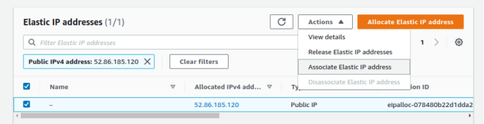
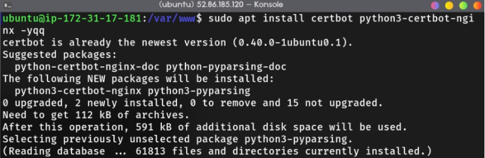
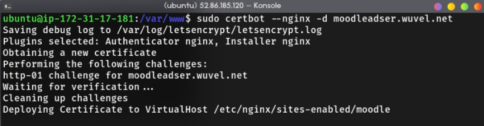
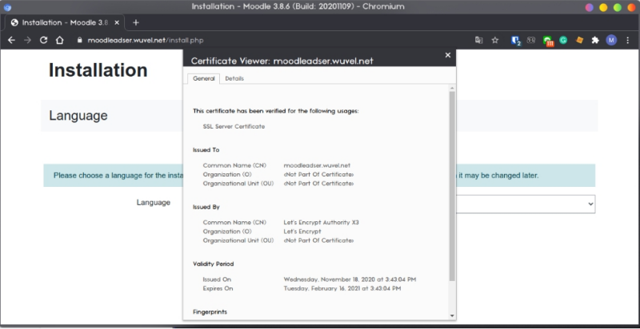

# Mid-term Project

The project is about configuring Moodle using AWS EC2 with 2 instance with the following requirements,

- First instance EC2 as a nginx webserver
- Second instance EC2 as a database server
- The site must have HTTPS
- The site must use a domain provided on the spreadsheet (or custom)

There's also additional requirements as follows,

- Use elastic IP for the instance
- For mysql, modify the configuration on /etc/mysql/my.cnf so that the bind address is 0.0.0.0 (the default was loopback ip 127.0.0.1)
- Open only the required port in SG (80, 443, 3306)

> As an additional notes, this is also a collaborative project. I partnered with [Fikri](wuvel.net) to finish the project, you can visit his website too :)

## Table of Contents <!-- omit in toc -->

- [Mid-term Project](#mid-term-project)
  - [EC2 Setup](#ec2-setup)
    - [Web Server](#web-server)
    - [Database Server](#database-server)
  - [LEMP Installation](#lemp-installation)
    - [Nginx](#nginx)
    - [MySQL](#mysql)
    - [PHP](#php)
  - [MySQL Configuration](#mysql-configuration)
  - [Moodle Configuration](#moodle-configuration)
    - [Clone or Download Moodle App](#clone-or-download-moodle-app)
    - [Create the MOODLEDATA Directory](#create-the-moodledata-directory)
    - [Configure Nginx](#configure-nginx)
    - [Adding SSL Certificate](#adding-ssl-certificate)

## EC2 Setup

We will create 2 instance for webserver and database. In the webserver instance, i'll open port 80 and 443 and for the database server i'll only open 3306 for mysql and 22 for SSH in each instance.

### Web Server

Just deploy new EC2 instance and make sure to configure the security group as follows,


After the instance is successfully deployed, allocate new elastic IP and associate it to the instance we created earlier.




### Database Server

Deploy the second instance with ubuntu 20.04 with security group to open port 22 and 3306.


Allocate new elastic ip and associate it to the instance.


## LEMP Installation

The next step is to install Nginx, MySQL, and PHP to serve the moodle webapp.

First thing first, update your repository first with

```bash
sudo bash -c "apt-get update && apt-get dist-upgrade && apt-get autoremove"
```

### Nginx

After the update is successfull, install nginx and start the services.


Enable nginx service so that it runs on startup automatically even after we restart the machine.


### MySQL

After that, install MySQL server in the second instance.


Don't forget to enable the services too.


### PHP

Then, install PHP with the required extension and php-fpm.


## MySQL Configuration

After we've been successfully installed mysql in the second instance, we will configure MySQL. Execute `mysql_secure_installation` command to configure this atribute,

- Setup root password
- Delete *anonymous* user
- Delete root remote login access
- Delete *test* database
- Reload privileges table

```bash
sudo mysql_secure_installation
```


Open mysql configuration file in `/etc/mysql/my.cnf` and change the port to 3306 and bind-address to 0.0.0.0.


Login as root to mysql console and create database and user for moodle.

```sql
CREATE DATABASE moodle;

CREATE USER 'moodleuser'@'your_webserver_ip_or_domain.com' identified by 'your_password';

GRANT ALL ON moodle.* TO 'moodleuser'@'your_webserver_ip_or_domain.com' identified by 'your_password';
GRANT ALL ON moodle.* TO 'moodleuser'@'your_webserver_ip_or_domain.com' WITH GRANT OPTION;

flush privileges;
```

> Make sure to grant moodle database only to your webserver instance and double check the IP/domain you want to enter.

This is optional, but if you want to create filter or firewall to your database so that only specific ip (your webserver) can access sql, use these following `iptables` command,

```bash
sudo iptables -A INPUT -p tcp -m tcp --dport 3306 -d your_webserver_ip -j ACCEPT
```

## Moodle Configuration

Now we're gonna setup moodle app. First make sure that `git` and `curl` are already installed.

```bash
sudo apt install git curl -y
```


### Clone or Download Moodle App

Clone moodle repository or use `curl` to download moodle app. Copy the moodle directory from the clone operation before to webserver directory (usually in /var/www for ubuntu).


### Create the MOODLEDATA Directory

Apart from moodle app directory, we must create another directory called `moodledata` (although you custom the name). [This directory is the location of files that are uploaded or created by Moodle Interface][1]. Configure it's permission and change the mode to 755 and the owner to www-data user and group (it may be a little different in other distro).

```bash
sudo cp -R moodle /var/www/
sudo mkdir -p /var/www/moodledata
sudo chown -R www-data:www-data /var/www/moodledata
sudo chown -R www-data:www-data /var/www/moodle
sudo chmod -R 755 /var/www/moodledata
sudo chmod -R 755 /var/www/moodle
```

### Configure Nginx

Create nginx config file in `/etc/nginx/sites-available` and link it to the sites-enabled directory. After that, check the syntax using `sudo nginx -t` and then restart nginx.

```bash
# You can use nano or prefered text editor
$ sudo vim /etc/nginx/sites-available/moodle

# Check nginx config format
$ sudo nginx -t

# Restart nginx
$ sudo systemctl restart nginx.service
```

This is my config file (you can create it like this)

```nginx
server {
    listen 80;
    listen [::]:80;
    root /var/ww/moodle;
    index index.php index.html index.htm;
    server_name tiftiga.tujuhlangit.id moodleadser.wuvel.net;

    client_max_body_size 100M;
    autoindex off;
    location / {
        try_files $uri $uri/ =404;
    }
    
    location /dataroot/ {
        internal;
        alias /var/ww/moodledata/;
    }
    location ~ [^/].php(/|$) {
        include snippets/fastcgi-php.conf;
        fastcgi_pass unix:/run/php/php7.4-fpm.sock;
        fastcgi_param SCRIPT_FILENAME $document_root$fastcgi_script_name;
        include fastcgi_params;
    }
}
```

A little note from me, in this configuration i wrote 2 domain for the `server_name` because the first one is the domain from spreadsheet and the second one is Fikri's domain to test if the server can be successfully served. You can actually implement multiple domain to points to your server as log as you create the A record in each DNS server. Common practice to use multiple subdomain like this is pointing `something.com` and `www.something.com` to the same web application.

> Your moodle should be served by now, check it on the port 80 and you can see the installation setup.

### Adding SSL Certificate

The last thing is adding SSL certificate so that the site serve with HTTPS (secure connection). To do that, we must first install certbot and python certbot module.

```bash
sudo apt install certbot python3-certbot-nginx -y
```



Execute certbot and specify the domain.

```bash
sudo certbot --nginx -d yourdomain.com
```



Check if the Certificate is Valid.



<!-- Reference Links -->
[1]: https://docs.moodle.org/19/en/Moodledata_directory
